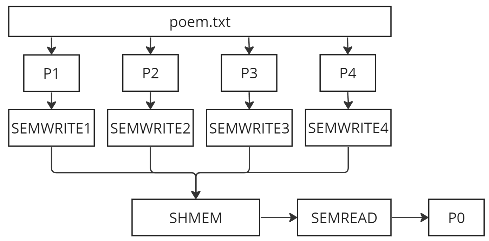

# Задание
Четыре дочерних процесса выполняют некоторые циклы работ, передавая после окончания очередного цикла через один и тот же сегмент разделяемой памяти родительскому процессу очередную строку некоторого стихотворения, 
при этом первый процесс передает 1-ю, 5-ю, 9-ю и т.д. строки, второй - 2-ю, 6-ю, 10-ю и т.д. строки, третий - 3-ю, 7-ю, 11-ю и т.д. строки, четвертый - 4-ю, 8-ю, 12- ю и т.д. строки. 
Циклы работ процессов не сбалансированы по времени. Родительский процесс компонует из передаваемых фрагментов законченное стихотворение и выводит его по завершении работы всех процессов. 
Решить задачу с использованием аппарата семафоров. 

# Описание использованных структур
### pid_t fork(void)
Порождение процесса-потомка, точной копии процесса-предка. Процесс-потомок в качестве возвращаемого значения системного вызова **fork()** получает 0, а процесс-предок - идентификатор процесса-потомка.

**void (\*signal (int signal, void (\*sigfunc) (int func)))(int)** \
Дает указание выполнить функцию, на которую указывает sigfunc, в случае получения сигнала signal.

### int kill(pid_t pid, int sig)
Системный вызов kill может быть использован для посылки какого-либо сигнала
какому-либо процессу или группе процесса. Если значение pid является положительным, сигнал sig посылается процессу с идентификатором pid. 
Если pid равен 0, то sig посылается каждому процессу, который входит в группу текущего процесса. Если pid равен -1, то sig посылается каждому процессу, 
за исключением процесса с номером 1 (init), но есть нюансы, которые описываются ниже. Если pid меньше чем -1, то sig посылается каждому процессу, который входит в группу процесса -pid. 
Если sig равен 0, то никакой сигнал не посылается, а только выполняется проверка на ошибку.

### int semget(key_t key, int nsems, int semflg)
Системный вызов secret() возвращает набор семафоров System V идентификатор, связанный с аргументом key. Его можно использовать либо для получения идентификатора ранее созданного семафора set или создать новый набор.
Новый набор семафоров nsems создаётся, если значение key равно IPC_PRIVATE  или  с  ключом key не связано ни одного существующего набора семафоров, а в semflg задано IPC_CREAT.

### int semctl(int semid, int semnum, int cmd, ...)
Функция semctl позволяет выполнять операции, определенные в cmd над набором семафоров, указанным в semid или над семафором с номером semnum из этого набора. (Семафоры нумеруются, начиная с 0.)

### int semop(int semid, struct sembuf *sops, unsigned nsops)
Функция производит операции над выбранными элементами из набора семафоров semid. Каждый из элементов nsops в массиве sops определяет операцию, производимую над семафором в структуре struct sembuf, с
остоящей из полей: short sem_num; short sem_op, short sem_flg.

### int shm_open(const char *name, int oflag, mode_t mode)
shm_open создает и открывает новый (или открывает уже существующий) объект разделяемой памяти POSIX. Операция shm_open аналогична open(2). name определяет собственно создаваемый объект разделяемой памяти для создания или открытия. 
oflag является маской битов, созданной через логическое сложение OR одного из флагов O_RDONLY или O_RWDR и любых других флагов. Поле mode задает права доступа к семафорам.

### int shm_unlink(const char *name)
Функция shm_unlink выполняет обратную операцию, удаляя объект, предварительно созданный с помощью shm_open. При операции shm_unlink удаляется имя объекта разделяемой памяти и, 
как только все процессы завершили работу с объектом и отменили его распределение, очищают пространство и уничтожают связанную с ним область памяти.

### int ftruncate(int fd, off_t length)
Функции ftruncate устанавливают длину обычного файла с файловым дескриптором fd в length байт. Если файл до этой операции был длиннее, то отсеченные данные теряются. Если файл был короче, 
то он увеличивается, а добавленная часть заполняется нулевыми байтами.

### void * mmap(void *start, size_t length, int prot , int flags, int fd, off_t offset)
Функция mmap отражает length байтов, начиная со смещения offset файла (или другого объекта), определенного файловым описателем fd, в память, начиная с адреса start. Последний параметр (адрес) необязателен, и обычно бывает равен 0. 
Настоящее местоположение отраженных данных возвращается самой функцией mmap, и никогда не бывает равным 0.

### void perror(const char *s)
Процедура perror() выводит в стандартный поток ошибки сообщения, описывая ошибку, произошедшую при последнем системном вызове или вызове библиотечной функции. 
Сначала (если s не равно NULL и *s не равно NULL) выводится строка s, затем двоеточие, пробел и сообщение, завершающееся переводом строки. Для большего удобства параметы строки должны содержать имя функции, вызвавшей ошибку. 
Номер ошибки извлекается из внешней переменной errno, которая устанавливается в случае ошибки, но не "очищается" в случае нормального завершения работы.

### pid_t wait(int *status)
Приостанавливает выполнение текущего процесса до тех пор, пока дочерний процесс не завершится, или до появления сигнала, который либо завершает текущий процесс, либо требует вызвать функцию-обработчик. 
Если дочерний процесс к моменту вызова функции уже завершился, то функция немедленно возвращается. Системные ресурсы, связанные с дочерним процессом, освобождаются.

### void exit(int value)
Выполняет немедленное завершение программы. Аргумент параметра value возвращается принимающей стороной (ОС или другой программой) в родительский процесс. 
Как правило, возвращается значение 0 или EXIT_SUCCESS указывает на успешное завершение программы, и любое другое значение или значение макроса EXIT_FAILURE используется для указания об аварийном завершении программы.

# Спецификация
Программа разработана и протестирована на компьютере с операционной системой Linux. В качестве компилятора используется GCC версии 11.4.0. \
Название файла: **PZ5.c** \
Компиляция программы на языке Си: gcc **main.c** -o <результат компиляции> \
Запуск программы на языке Си: ./<результат компиляции>

# Алгоритм работы на языке C

0) Будем обозначать за P0 - родительский процесс, а P1, P2, P3 и P4 - дочерние процессы.
1) Создаем четыре семафора (SEMWRITE) на запись и один семафор (SEMREAD) на чтение и установим их как закрытые.
2) При помощи fork() создаем P1, P2, P3, P4.
3) В P0 открываем SEMWRITE1 для P1.
4) После разблокировки P1 он «закрывает за собой SEMWRITE1», записывает данные в SHMEM, открывает SEMREAD и встает на ожидание пока другой процесс не разблокирует SEMWRITE1.
5) После разблокировки P0 он «закрывает за собой SEMREAD», выводит в stdout данные, разблокирует SEMWRITE2 и встает на ожидание пока другой процесс не разблокирует SEMREAD1.
6) Повторяем 4-5 пункт меняя SEMWRITE(i), пока не закончится файл poem.txt.
7) Из дочерних процессов посылаем сигнал родительском об окончании отсылки данных в SHMEM.
8) Родительский процесс ожидает завершение всех дочерних процессов и заканчивает работу.